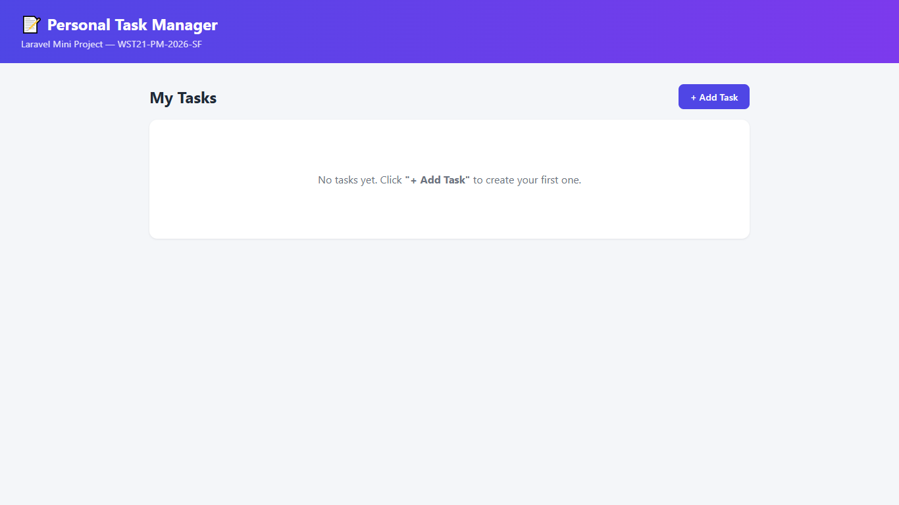
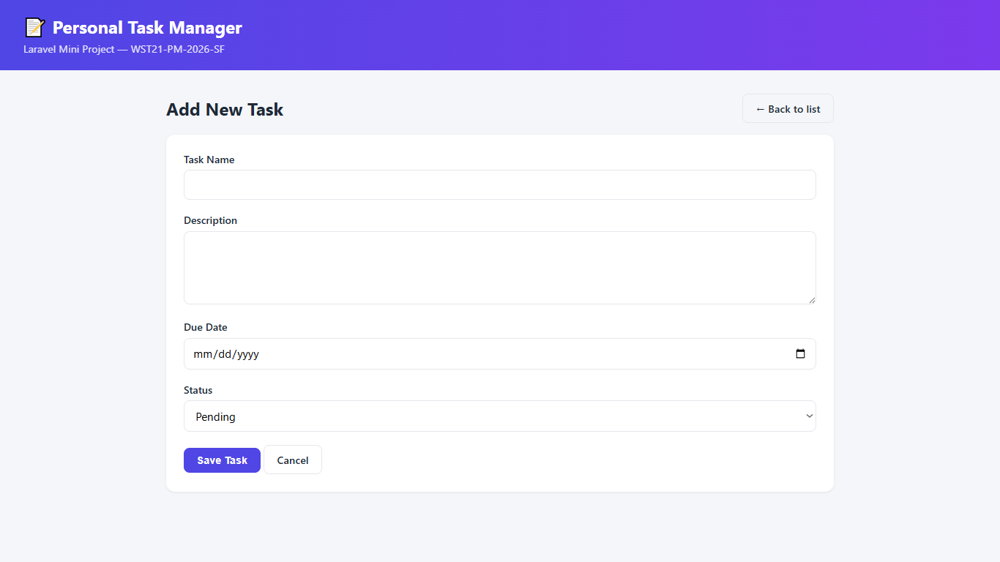
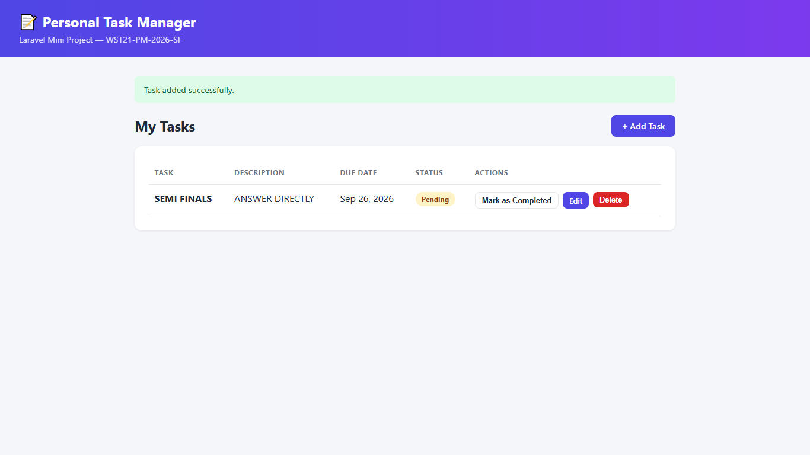

# Personal Task Manager

  Project Code:   WST21-PM-2026-SF
  Student Name:   PARBA KURT JOSEFF Z.
  Course & Year:   BSIT 2 - SECTION 2
  Database Used:   SQLite

## About This Project

This is my Laravel mini project for a Personal Task Manager. It's a simple web app where I can add my daily tasks, view them all in one place, edit them, delete them, and mark them as Pending or Completed. I built it to practice the full Laravel flow of Routes, Controller, Model, Database, and Blade views working together.

## Features

- Add Task
- View Tasks
- Edit Task
- Delete Task
- Update Status

## How I Built It

I created a `Task` model connected to a `tasks` table in the database, with fields for the task name, description, status, and due date. All the logic for creating, reading, updating, and deleting tasks lives in `TaskController`, and each action has its own route in `routes/web.php`. The pages themselves are Blade views: one for the task list, one for adding a task, and one for editing a task, all sharing a common layout so the design stays consistent.

For the status feature, instead of making the user open the edit form just to change Pending to Completed, I added a separate route and button that flips the status with one click.

I used SQLite for the database since it's simple to set up and doesn't need a separate database server, which made it easier to work with in my development environment.

## Running the Project

```bash
composer install
cp .env.example .env
php artisan key:generate
touch database/database.sqlite
php artisan migrate
php artisan serve
```

## Screenshots



(Screenshots of my task list, add form, edit form, and status toggle go here.)